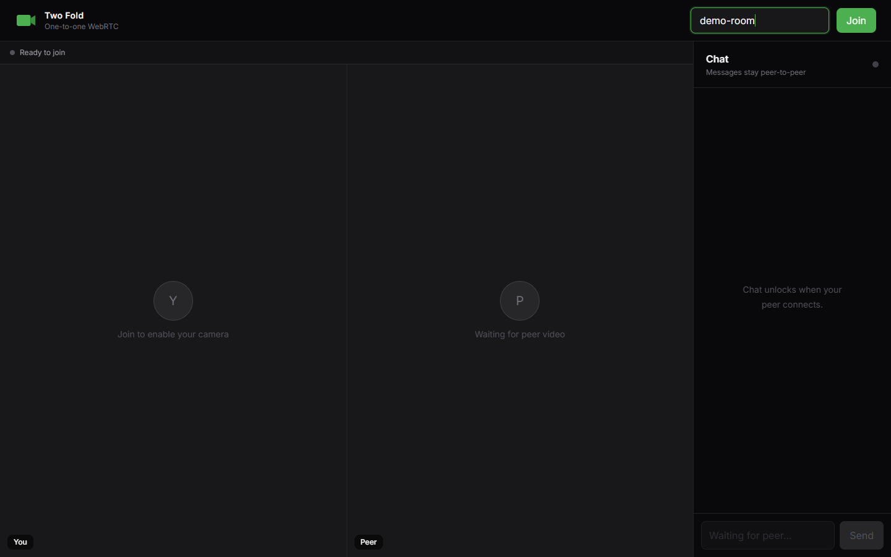
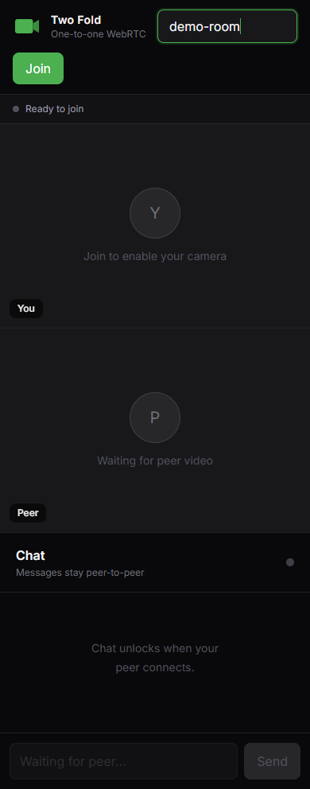

<div align="center">
  
  <h1>Two Fold</h1>
  <p>Private one-to-one video calls and text chat powered by WebRTC.</p>
</div>

The signaling server only exchanges connection metadata; media and messages travel directly between peers.

## Screenshots





## Features

- One-to-one audio and video calls
- Peer-to-peer text chat using an RTC data channel
- Two-person room limit
- Automatic signaling reconnection and ICE restart
- Permission, connection, and disconnect error handling

## Run locally

Requires Node.js 22+ and npm 10+.

```bash
npm ci
cp backend/.env.example backend/.env
cp frontend/.env.example frontend/.env
npm run dev
```

Open `http://localhost:5173` in two browser tabs and join the same room. Camera and microphone access requires `localhost` or HTTPS.

## Configuration

| Variable | Default | Purpose |
| --- | --- | --- |
| `PORT` | `3001` | Signaling server port |
| `ALLOWED_ORIGINS` | `*` | Comma-separated frontend origins |
| `VITE_SIGNALING_URL` | `http://localhost:3001` | Public signaling server URL |
| `VITE_ICE_SERVERS` | Public STUN server | JSON array of `RTCIceServer` objects |

Use an authenticated TURN server for reliable production connectivity across restrictive networks.

## Commands

```bash
npm test          # Signaling integration tests
npm run typecheck # Backend TypeScript check
npm run build     # Build backend and frontend
```

## Docker

Docker runs the signaling backend only:

```bash
docker compose up --build -d
curl http://localhost:3001/health
docker compose logs -f signaling
```

The frontend can be deployed to Vercel from `frontend/`. Deploy the backend container to a persistent WebSocket-capable host and set `VITE_SIGNALING_URL` and `ALLOWED_ORIGINS` to the deployed URLs.
